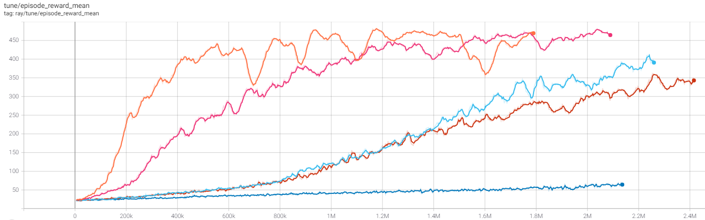
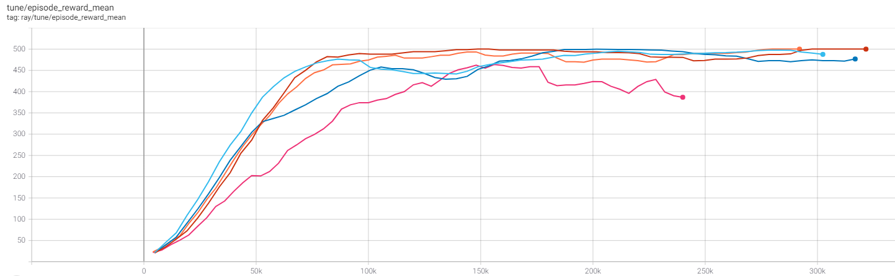
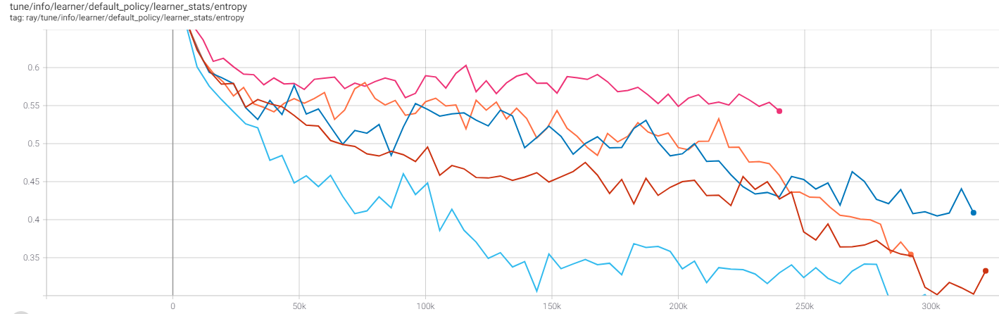
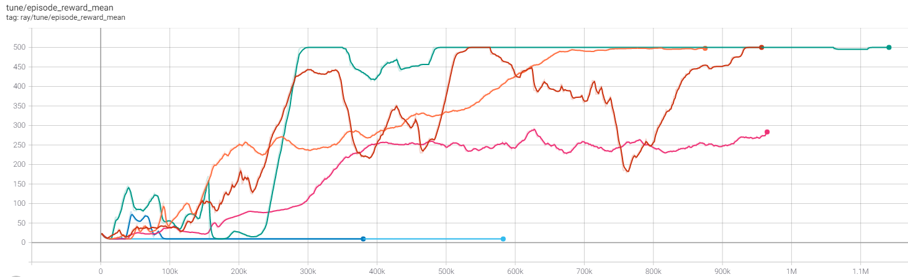
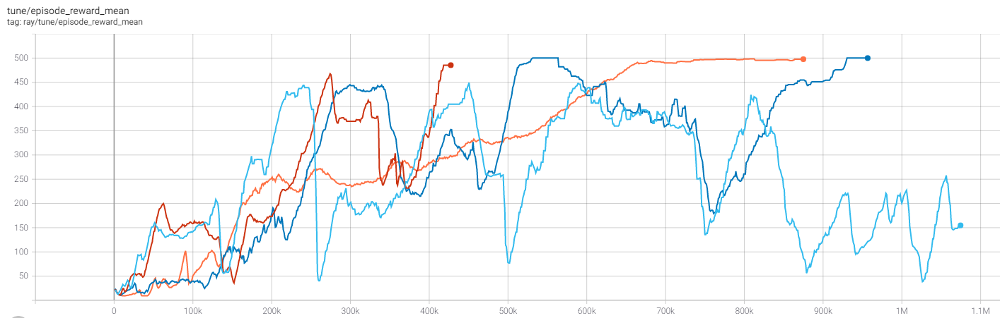

# Ray RLlib Cartpole

Simple script to test out basic RL algorithms on Cartpole

## Usage

Python dependencies are in requirements.txt

```
pip install -r requirements.txt
```

Before the script is run an instance of ray must be started

```
ray start --head
```

Finally the script can be run

```
python train.py
```

And the results can be seen in tensorboard 

```
tensorboard --logdir <checkpoints_directory_path>
```

## Experiments

Cartpole provides a super simple environment from which important concepts in RL can be explored in an efficeint and interpretable way. Below is a short exploration into the impact of model size and algorithm choice on an agent's learning.

### PG Mean Reward


**Orange - Two hidden Layers 32 neurons each**<br />
**Pink - One hidden Layer of 32 neurons**<br />
**Light Blue - Two hidden Layers 4 neurons each**<br />
**Red - One hidden Layer of 4 neurons**<br />
**Blue - Linear**<br />
<br />

First we can look at how network size affects learning using the vanilla Policy Gradient algorithm. Unsurprisingly there is a clear trend of larger capacity models learning faster and performing better overall, with the linear model failing to make significant progress. It should be noted however that the two 32 neuron layer network's learning is quite noisy, suggesting that it perhaps is larger than it needs to be for the simple task at hand (this is explored further with DQN in the last plot).

### PPO Mean Reward


**Light Blue - Two hidden Layers 32 neurons each**<br />
**Red - One hidden Layer of 32 neurons**<br />
**Blue - Two hidden Layers 4 neurons each**<br />
**Orange - One hidden Layer of 4 neurons**<br />
**Pink - Linear**<br />
<br />

We can see how this changes with Proximal Policy Optimization (PPO). PPO is an extremely stable and efficient algorithm that has been essential in tackling harder problems in RL. It should be no surprise then that it absolutely dominates here, showing much faster convergence (although that is in large part because of sample reuse) and even managing to get the linear model performing well. 

### PPO Entropy


**Light Blue - Two hidden Layers 32 neurons each**<br />
**Red - One hidden Layer of 32 neurons**<br />
**Blue - Two hidden Layers 4 neurons each**<br />
**Orange - One hidden Layer of 4 neurons**<br />
**Pink - Linear**<br />
<br />

It is worth briefly mentioning entropy, as it is an essential metric for gauging where the network is in its learning process. In general a network's entropy will drop as it learns and will go up or stay stagnant if it is recieving conflicting signals (or if it lacks the capacity to effectively interpret those signals). Thus we can see how a network's learning is progressing and get an idea of how much it has learned byb looking at the entropy of its action distribution. This plot is a perfect illustration of this concept as it shows the higher capacity model's entropy dropping quickly as they are able to quickly learn from thier experience while the smaller capacity models struggle to convert thier experience into weight updates and thus see thier entropy drop slower.

## DQN Mean Reward


**Red - Two hidden Layers 32 neurons each**<br />
**Orange - One hidden Layer of 32 neurons**<br />
**Green - Two hidden Layers 4 neurons each**<br />
**Pink - One hidden Layer of 4 neurons**<br />
**Light Blue - Linear**<br />
**Blue - Linear (try #2)**<br />
<br />

We can also look at DQN. Like PPO the DQN algorithm also makes use of past experience and as such it is able to reach optimal performance much faster than vanilla PG. DQN's constant probability epsilon-greedy action selection mechanism also leads to a lot choppier of a learning curve as the DQN lacks the ability to smoothly move from a random to deterministic policy like in policy gradient mechanisms. It is also interesting to note that the linear model completely fails to learn here, while the 4 neuron model seems to converge to a suboptimal solution. It seems a slightly bigger network is helpful in allowing the DQN to learn.

## DQN Network Depth Mean Reward


**Light Blue - Four hidden Layers 32 neurons each**
**Red - Three hidden Layers 32 neurons each**
**Blue - Two hidden Layers 32 neurons each**
**Orange - One hidden Layer of 32 neurons**
<br />

Lastly we can quickly explore the effect of using deeper networks on learning. Cartpole is a very simple problem and so using deeper networks than is necesary can lead to unstable learning. Therefore it is important not to use a network much bigger than you need (although in this case the effect could likely be mitigated by tuning the hyperparameters for the larger networks).
